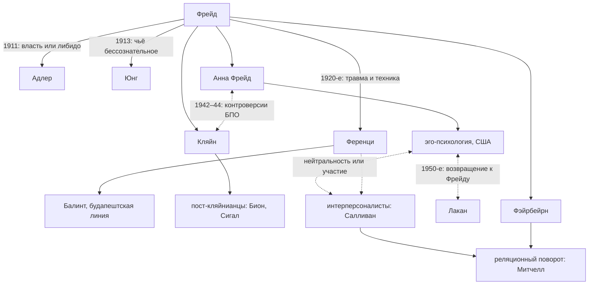
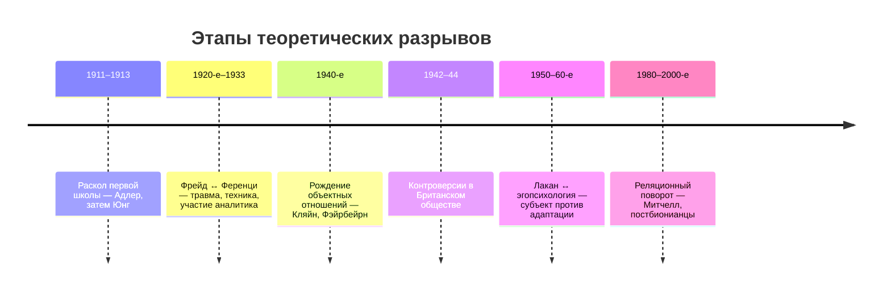

#оппозиция 

> [!quote] Психоанализ развивается через различия
> Карта линий расхождения — от первых расколов до реляционного поворота. Каждый спор здесь — не просто конфликт людей, а теоретический вопрос, который поле не смогло решить и потому разделилось. Узлы с тегом #оппозиция — это и есть эти вопросы.

## Генеалогия расколов

## Именные споры

| узел | когда | ядро спора |
|---|---|---|
| [[Фрейд vs Альфред Адлер]] | 1911 | либидозная динамика ↔ стремление к превосходству и признанию |
| [[Фрейд vs Карл Юнг]] | 1913 | личное бессознательное ↔ архетипическая структура |
| [[Фрейд vs Ференци]] | 1920-е–1933 | нейтральность ↔ участие; фантазия ↔ реальная травма; что лечит — интерпретация или новый опыт |
| [[Разногласия в БПО (1942–44)]] | 1942–44 | Кляйн ↔ Анна Фрейд: статус бессознательной фантазии, техника детского анализа, обучение |
| [[Фэйрбейрн vs Фрейд]] | 1940–50-е | влечение ищет удовольствия ↔ либидо ищет объект |
| [[Фэйрбейрн vs Кляйн]] | 1940–50-е | внутренний объект: реальный персонаж ↔ фантазийное сцепление |
| [[Лакан vs эгопсихология]] | 1950–60-е | эго как функция адаптации ↔ эго как воображаемая иллюзия |
| [[Лакан vs Юнг]] | — | символическое ↔ архетипическое |
| [[Интерперсональный психоанализ vs Американские фрейдисты]] | 1940–70-е | межличностное поле ↔ интрапсихическая ортодоксия |

## Сквозные оппозиции

Вопросы, которые не принадлежат одной паре имён, а прошивают всю историю поля — почти в каждом именном споре узнаётся какая-то из этих осей:

| ось | вопрос | где вспыхивала |
|---|---|---|
| [[травма vs фантазия]] | психику ранит реальное событие или психическая реальность? | [[Фрейд vs Ференци]], [[Разногласия в БПО (1942–44)]] |
| [[интерпретация vs отношения]] | лечит понимание или новый опыт связи? | [[ferenczi rank 1924]], [[Марьенбадская конференция]], [[Эдинбургская конференция 1961 о терапевтическом действии]] |
| [[дефицит vs конфликт]] | пациенту чего-то не хватило — или в нём что-то сталкивается? | попытка синтеза: [[разрешение спора о конфликте vs дефиците]] |
| [[важность объектов vs важность влечений]] | что первично в мотивации? | [[Фэйрбейрн vs Фрейд]], [[Greenberg Mitchell 1983]] |
| [[самораскрытие vs анонимность]] | аналитик — зеркало или живой участник? | от Ференци до реляционных техник |
| [[гибкость vs стабильность]] | что страшнее для пациента — ригидность или непоследовательность рамки? | [[Greenberg 2011]] |
| [[структурная модель vs модель объектных отношений]] | психика — инстанции или внутренние персонажи? | чем суперэго отличается от внутренних объектов |
| [[одно и двухперсонный психоанализ]] | единица анализа — психика или пара? | [[Будапештская школа психоанализа]], [[Реляционный психоанализ]] |

Отдельное наблюдение: [[проблема неанализабельности нарциссизма отчасти была ответственна за контроверсии]] — споры вспыхивали там, где классическая техника упиралась в «неанализируемых» пациентов.

Новый фронт: [[ии vs психоанализ]].

## Хронология

## Как читать эту карту

Оппозиции здесь — не соревнование «кто прав», а способ, которым поле думает ([[Принципы ризомы в контексте психоанализа]]). Почти каждый спор заканчивался не победой, а тем, что вопрос переезжал в новую школу и задавался заново: спор Фрейда и Ференци о травме вернулся в [[Разногласия в БПО (1942–44)]], потом в реляционную клинику, а сегодня — в лапланшевскую линию ([[Травма]], [[Авги Сакетопулу]]).
